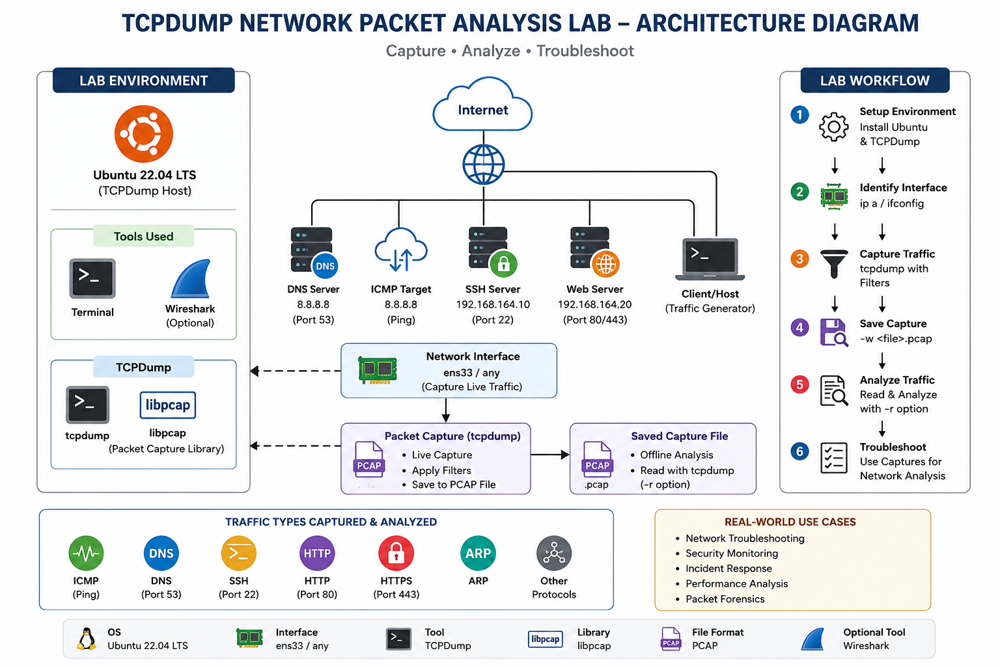
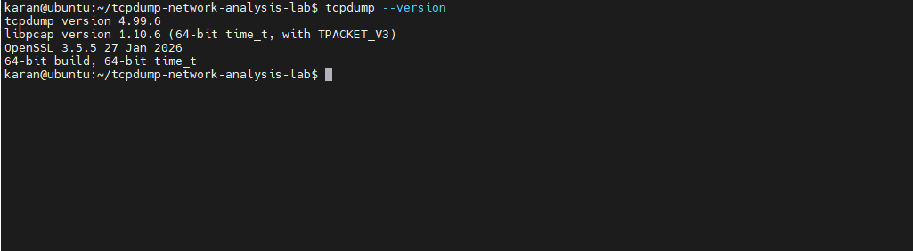
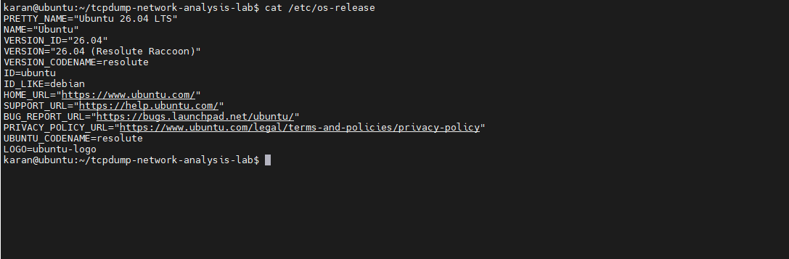
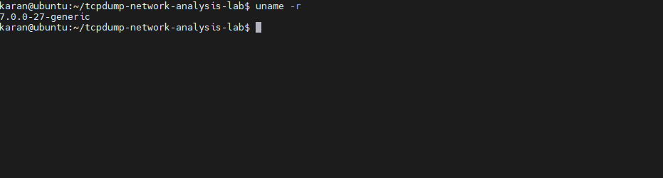
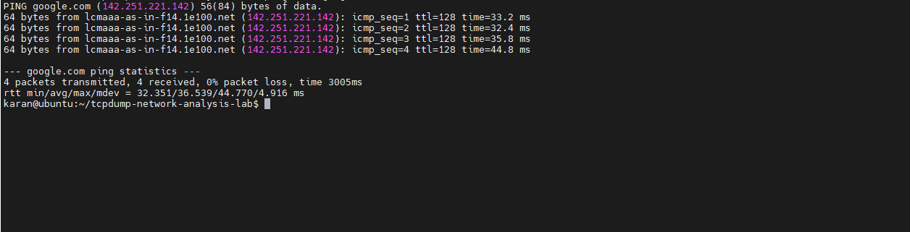
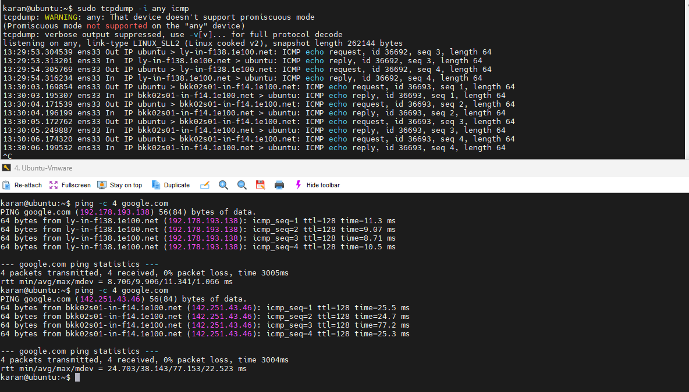
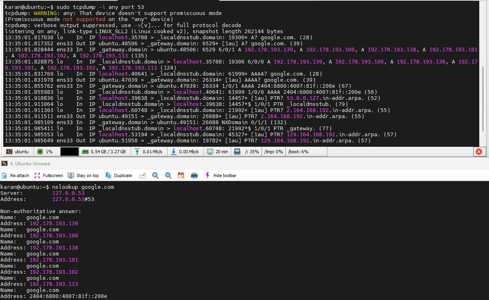
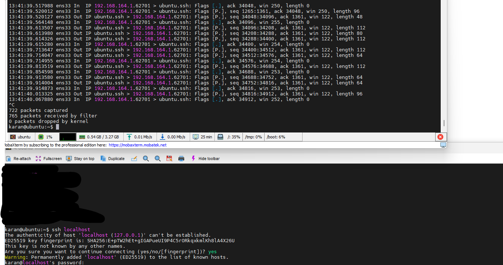
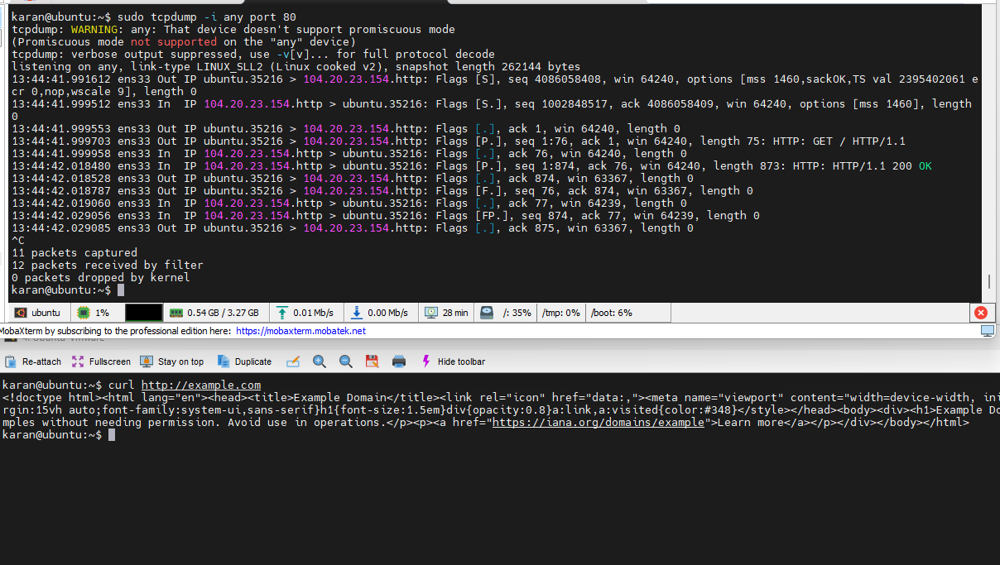
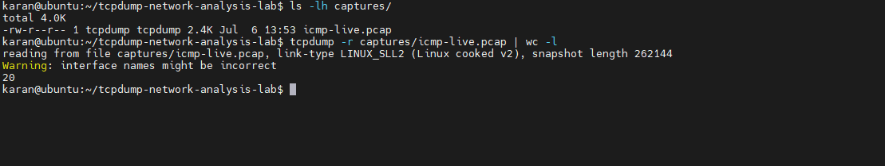

# TCPDump Network Packet Analysis Lab


---

## Architecture Diagram



> **Figure 1:** High-level workflow of the TCPDump Network Packet Analysis Lab, illustrating packet capture, protocol analysis, PCAP generation, and troubleshooting.

---

## Table of Contents

- [Project Overview](#project-overview)
- [Architecture Diagram](#architecture-diagram)
- [Objectives](#objectives)
- [Lab Environment](#lab-environment)
- [Project Structure](#project-structure)
- [Installation & Verification](#installation--verification)
- [Phase 1 - Environment Setup](#phase-1---environment-setup)
- [Phase 2 - Installing & Understanding TCPDump](#phase-2--installing--understanding-tcpdump)
- [Phase 3 - Live Packet Capture & Protocol Analysis](#phase-3--live-packet-capture--protocol-analysis)
- [Phase 4 - Save & Read PCAP Files](#phase-4--save--read-pcap-files)
- [Phase 5 - TCPDump Filter Cheat Sheet](#phase-5--tcpdump-filter-cheat-sheet)
- [Real-World Troubleshooting Scenarios](#real-world-troubleshooting-scenarios)
- [Interview Questions](#interview-questions)
- [Key Learnings](#key-learnings)
- [Skills Gained](#skills-gained)
- [Future Improvements](#future-improvements)
- [Conclusion](#conclusion)
- [About the Author](#about-the-author)
- [Cybersecurity Home Lab Series](#cybersecurity-home-lab-series)
- [License](#license)

---

## Project Overview

This project demonstrates how to capture, analyze, filter, and save network packets using **TCPDump** on Ubuntu Linux.

The lab covers the complete workflow from installing TCPDump to capturing live network traffic, filtering packets based on protocols and hosts, saving packet captures into PCAP files, and performing offline packet analysis.

The project was created as a hands-on cybersecurity lab to build practical packet analysis skills and understand how network traffic can be inspected during troubleshooting and security investigations.

---

## Objectives

The primary objectives of this project are:

- Understand the purpose and architecture of TCPDump.
- Learn how to capture live network packets.
- Analyze ICMP, DNS, SSH, and HTTP traffic.
- Save captured traffic into PCAP files.
- Perform offline packet analysis using saved captures.
- Learn commonly used TCPDump filters.
- Practice basic network troubleshooting using packet captures.
- Build a GitHub-ready cybersecurity project with proper documentation.

---

## Key Features

- TCPDump installation and verification
- Live packet capture
- ICMP packet analysis
- DNS packet analysis
- SSH traffic capture
- HTTP traffic capture
- Save packets into PCAP files
- Offline packet analysis
- TCPDump filtering techniques
- Real-world troubleshooting examples
- Interview-focused notes
- Complete project documentation

---

## Skills Demonstrated

- Linux
- TCPDump
- Packet Capture
- Network Traffic Analysis
- ICMP
- DNS
- SSH
- HTTP
- PCAP Analysis
- Linux Networking
- Network Troubleshooting
- Cybersecurity Documentation


---

# Lab Environment

| Component | Details |
|----------|---------|
| Operating System | Ubuntu 26.04 LTS |
| Tool | TCPDump 4.99.6 |
| Packet Capture Library | libpcap 1.10.6 |
| Shell | Bash |
| Network Interface | ens33 |
| Virtualization Platform | VMware Workstation |
| Capture Format | PCAP |
| Protocols Analyzed | ICMP, DNS, SSH, HTTP |

---

# Project Structure

```text
tcpdump-network-analysis-lab/
│
├── captures/
│   └── icmp-live.pcap
│
├── docs/
│   └── screenshots/
│       ├── P1-01-os-version.png
│       ├── P1-02-kernel-version.png
│       ├── P1-03-network-interface.png
│       ├── P2-01-tcpdump-version.png
│       ├── P3A-01-icmp-capture.png
│       ├── P3B-01-dns-capture.png
│       ├── P3C-01-ssh-capture.png
│       ├── P3D-01-http-capture.png
│       └── P4-01-save-read-pcap.png
│
├── LICENSE
└── README.md
```

---

# Lab Workflow

```text
Install TCPDump
        │
        ▼
Verify Installation
        │
        ▼
Discover Network Interfaces
        │
        ▼
Capture Live Traffic
        │
        ▼
Analyze Packets
        │
        ▼
Save Packets (.pcap)
        │
        ▼
Read PCAP Files
        │
        ▼
Apply Packet Filters
        │
        ▼
Perform Network Troubleshooting
```

---

# Prerequisites

Before starting this lab, ensure the following requirements are met:

- Ubuntu Linux installed
- Administrative (sudo) privileges
- Internet connectivity
- Basic Linux command-line knowledge
- Git (optional for version control)
- TCPDump installed (or install during this lab)

---

# Learning Outcomes

After completing this project, you will be able to:

- Install and verify TCPDump on Linux.
- Capture live network traffic from different interfaces.
- Analyze common network protocols.
- Save packet captures in PCAP format.
- Perform offline packet analysis.
- Apply TCPDump filters to isolate specific traffic.
- Understand basic packet-based troubleshooting.
- Document a complete packet analysis workflow.

---

# Installation & Verification

## Step 1 - Update Package Repository

```bash
sudo apt update
```

Updating the package repository ensures that the latest package information is available before installing TCPDump.

---

## Step 2 - Install TCPDump

```bash
sudo apt install tcpdump -y
```

This installs TCPDump along with its required dependencies.

---

## Step 3 - Verify Installation

```bash
tcpdump --version
```

Expected output:

```text
tcpdump version 4.99.6
libpcap version 1.10.6
```

**Screenshot**



---

# Phase 1 - Environment Setup

Before capturing network traffic, it is important to understand the Linux environment where TCPDump will be used.

This phase verifies the operating system, kernel version, and available network interfaces.

---

## 1. Verify Operating System

```bash
cat /etc/os-release
```

This command displays detailed operating system information.

**Screenshot**



---

## 2. Verify Linux Kernel Version

```bash
uname -r
```

This command displays the currently running Linux kernel version.

The kernel manages hardware resources, networking, process scheduling, and system security.

**Screenshot**



---

## 3. Display Network Interfaces

```bash
ip addr
```

This command displays all available network interfaces along with their IP addresses.

During this lab, the following interfaces were observed:

- **lo** – Loopback interface used for local communication.
- **ens33** – Primary network interface connected to the virtual network.

Understanding network interfaces is essential because TCPDump captures traffic from a selected interface.

**Screenshot**



---

# Phase 1 Summary

In this phase, the lab environment was verified successfully.

The following tasks were completed:

- Verified Ubuntu operating system.
- Verified Linux kernel version.
- Identified available network interfaces.
- Confirmed the interface that will be used for packet capture.

---

# Phase 2 – Installing & Understanding TCPDump

## Objective

The objective of this phase is to install TCPDump, verify the installation, understand its dependencies, and become familiar with the basic commands required before capturing network traffic.

---

## What is TCPDump?

TCPDump is a command-line packet analyzer used to capture and inspect network packets in real time.

It is one of the most widely used networking and cybersecurity tools for troubleshooting network issues, analyzing protocols, monitoring traffic, and performing basic packet-level investigations.

Unlike graphical tools such as Wireshark, TCPDump is lightweight and commonly used on Linux servers where a graphical interface is not available.

---

## Understanding libpcap

TCPDump uses **libpcap (Packet Capture Library)** to capture packets from the network interface.

The packet capture flow is:

```text
Network Interface
        │
        ▼
Linux Kernel
        │
        ▼
libpcap
        │
        ▼
TCPDump
        │
        ▼
Terminal
```

Without libpcap, TCPDump cannot capture network traffic.

---

## Verify TCPDump Installation

```bash
tcpdump --version
```

This command verifies that TCPDump is installed correctly and also displays the installed libpcap version.

**Screenshot**


---

## Locate TCPDump Binary

```bash
which tcpdump
```

This command displays the location of the TCPDump executable.

Example:

```text
/usr/bin/tcpdump
```

---

## Display Available Options

```bash
tcpdump --help
```

This command displays all supported TCPDump options and command syntax.

Some of the commonly used options include:

| Option | Description |
|---------|-------------|
| `-i` | Select network interface |
| `-c` | Capture a specific number of packets |
| `-w` | Save packets to a PCAP file |
| `-r` | Read packets from a PCAP file |
| `-n` | Disable hostname resolution |
| `-v` | Increase output verbosity |
| `-X` | Display packets in Hex and ASCII |

---

## Verify Linux Capabilities

```bash
getcap /usr/bin/tcpdump
```

Some Linux distributions assign capabilities such as `CAP_NET_RAW` and `CAP_NET_ADMIN` to TCPDump, allowing packet capture without running the command as the root user.

In this lab, no additional capabilities were configured, so TCPDump was executed using `sudo`.

---

## Verify File Permissions

```bash
ls -l /usr/bin/tcpdump
```

This command displays the ownership and permissions of the TCPDump executable.

Understanding Linux file permissions helps explain why packet capture usually requires elevated privileges.

---

# Phase 2 Summary

In this phase, the following tasks were completed:

- Installed TCPDump.
- Verified the installation.
- Verified the installed libpcap version.
- Located the TCPDump executable.
- Reviewed commonly used command-line options.
- Verified Linux capabilities.
- Reviewed executable permissions.

---

# Phase 3 – Live Packet Capture & Protocol Analysis

## Objective

The objective of this phase is to capture live network traffic and analyze commonly used network protocols.

During this lab, TCPDump was used to capture and inspect:

- ICMP
- DNS
- SSH
- HTTP

Each protocol demonstrates a different aspect of network communication and helps build a practical understanding of packet analysis.

---

# 3A – ICMP Packet Capture

## Objective

Capture ICMP packets generated by the `ping` command.

---

## Command

Terminal 1

```bash
sudo tcpdump -i any icmp
```

Terminal 2

```bash
ping -c 4 8.8.8.8
```

---

## Explanation

The `icmp` filter captures only ICMP traffic.

The `ping` command generates **ICMP Echo Request** packets, and the destination host responds with **ICMP Echo Reply** packets.

This is one of the simplest methods to verify network connectivity.

---

## Observation

During the packet capture, TCPDump displayed:

- Echo Request packets leaving the local machine.
- Echo Reply packets received from the destination.
- Packet sequence numbers.
- Packet length.
- Source and destination hosts.

---

## Screenshot



---

## Key Learning

ICMP packet capture is commonly used to verify basic network connectivity and troubleshoot communication issues between systems.

---

# 3B – DNS Packet Capture

## Objective

Capture DNS queries and responses generated during hostname resolution.

---

## Command

Terminal 1

```bash
sudo tcpdump -i any port 53
```

Terminal 2

```bash
nslookup google.com
```

---

## Explanation

DNS uses port **53** for hostname resolution.

When `nslookup` is executed, the local DNS resolver sends a query to the configured DNS server and receives the corresponding IP address.

---

## Observation

During this lab, the following DNS activities were observed:

- DNS Query
- DNS Response
- IPv4 (A Record)
- IPv6 (AAAA Record)
- Local DNS Stub Resolver
- Upstream DNS Server Communication

---

## Screenshot



---

## Key Learning

TCPDump can be used to troubleshoot DNS resolution problems by verifying whether DNS queries and responses are successfully exchanged.

---

# 3C – SSH Packet Capture

## Objective

Capture SSH traffic using a protocol-specific filter.

---

## Command

Terminal 1

```bash
sudo tcpdump -i any port 22
```

Terminal 2

```bash
ssh localhost
```

---

## Explanation

SSH uses TCP port **22**.

By filtering only port 22 traffic, unrelated packets are ignored, making it easier to observe SSH communication.

---

## Observation

The capture confirmed successful SSH communication over TCP port 22.

Only SSH packets were displayed because of the applied filter.

---

## Screenshot



---

## Key Learning

Protocol-specific filtering significantly reduces unnecessary output and simplifies packet analysis.

---

# 3D – HTTP Packet Capture

## Objective

Capture HTTP traffic using TCPDump.

---

## Command

Terminal 1

```bash
sudo tcpdump -i any port 80
```

Terminal 2

```bash
curl http://example.com
```

---

## Explanation

Modern websites primarily use HTTPS (TCP port 443), so an HTTP-only website was used to generate plain HTTP traffic over port 80.

---

## Observation

The packet capture confirmed communication over TCP port 80.

This demonstrated how TCPDump can isolate traffic based on specific ports.

---

## Screenshot



---

## Key Learning

Port-based filters make it easy to monitor specific application protocols without capturing unrelated network traffic.

---

# Phase 3 Summary

In this phase, live packet captures were successfully performed for multiple protocols.

The following protocols were analyzed:

- ICMP
- DNS
- SSH
- HTTP

Each protocol was captured using protocol-specific filters to simplify packet analysis and understand different types of network communication.

---

# Phase 4 – Save & Read PCAP Files

## Objective

The objective of this phase is to learn how to save captured network traffic into a **PCAP (Packet Capture)** file and perform offline packet analysis using TCPDump.

Saving packet captures allows security analysts and network engineers to investigate network activity without requiring live traffic.

---

## Save Packet Capture

### Command

```bash
sudo tcpdump -i any icmp -w captures/icmp-live.pcap
```

### Explanation

The `-w` option writes captured packets directly to a **PCAP** file instead of displaying them on the terminal.

PCAP files are the standard format used by tools such as TCPDump and Wireshark for packet analysis.

---

## Generate Traffic

In another terminal, generate ICMP traffic.

```bash
ping -c 4 8.8.8.8
```

Stop the packet capture using:

```text
Ctrl + C
```

---

## Verify the Capture File

```bash
ls -lh captures/
```

This command verifies that the PCAP file was successfully created.

---

## Read the Saved PCAP File

### Command

```bash
tcpdump -r captures/icmp-live.pcap
```

### Explanation

The `-r` option reads packets from an existing PCAP file.

Unlike live packet capture, this method allows previously captured traffic to be analyzed multiple times without generating new network traffic.

---

## Screenshot



---

## Key Learning

This phase demonstrated the complete packet capture workflow:

- Capture live packets
- Save packets into a PCAP file
- Verify the capture file
- Perform offline packet analysis

---

# Phase 4 Summary

The following tasks were successfully completed:

- Captured live ICMP traffic.
- Saved the captured packets into a PCAP file.
- Verified the PCAP file.
- Read the saved capture using TCPDump.
- Understood the difference between live packet capture and offline packet analysis.

---

# Phase 5 – TCPDump Filter Cheat Sheet

Packet filters allow TCPDump to capture only the traffic that is relevant to a specific investigation. Filtering unnecessary packets makes troubleshooting faster and simplifies packet analysis.

---

## Host Filter

Capture packets where the specified IP address is either the source or destination.

```bash
sudo tcpdump -i any host 8.8.8.8
```

---

## Source Host Filter

Capture packets only when the specified IP address is the source.

```bash
sudo tcpdump -i any src host 8.8.8.8
```

---

## Destination Host Filter

Capture packets only when the specified IP address is the destination.

```bash
sudo tcpdump -i any dst host 8.8.8.8
```

---

## Protocol Filters

Capture ICMP packets.

```bash
sudo tcpdump -i any icmp
```

Capture TCP packets.

```bash
sudo tcpdump -i any tcp
```

Capture UDP packets.

```bash
sudo tcpdump -i any udp
```

Capture ARP packets.

```bash
sudo tcpdump -i any arp
```

---

## Port Filters

Capture DNS traffic.

```bash
sudo tcpdump -i any port 53
```

Capture SSH traffic.

```bash
sudo tcpdump -i any tcp port 22
```

Capture HTTP traffic.

```bash
sudo tcpdump -i any tcp port 80
```

Capture HTTPS traffic.

```bash
sudo tcpdump -i any tcp port 443
```

---

## Network Filter

Capture traffic for an entire subnet.

```bash
sudo tcpdump -i any net 192.168.164.0/24
```

---

## Logical Operators

Capture ICMP packets for a specific host.

```bash
sudo tcpdump -i any host 8.8.8.8 and icmp
```

Capture HTTP or HTTPS traffic.

```bash
sudo tcpdump -i any port 80 or port 443
```

Capture all traffic except SSH.

```bash
sudo tcpdump -i any not port 22
```

---

## Packet Count

Capture only the first ten packets.

```bash
sudo tcpdump -i any -c 10
```

---

## Disable Hostname Resolution

Display IP addresses instead of resolving hostnames.

```bash
sudo tcpdump -i any -n
```

---

## Verbose Output

Display additional packet information.

```bash
sudo tcpdump -i any -vv
```

---

## Hex and ASCII Output

Display packet contents in hexadecimal and ASCII format.

```bash
sudo tcpdump -i any -X
```

---

## File Operations

Write packets to a PCAP file.

```bash
sudo tcpdump -i any -w capture.pcap
```

Read packets from a saved PCAP file.

```bash
tcpdump -r capture.pcap
```

---

# Real-World Troubleshooting Scenarios

## Scenario 1 – Verify Network Connectivity

**Problem**

A Linux server cannot reach an external system.

**Command**

```bash
sudo tcpdump -i any icmp
```

**Observation**

Verify whether ICMP Echo Request and Echo Reply packets are exchanged.

---

## Scenario 2 – DNS Resolution Failure

**Problem**

Users can access the network but cannot open websites using domain names.

**Command**

```bash
sudo tcpdump -i any port 53
```

**Observation**

Check whether DNS queries are sent and valid responses are received.

---

## Scenario 3 – SSH Connectivity Issue

**Problem**

Unable to establish an SSH connection to a remote server.

**Command**

```bash
sudo tcpdump -i any tcp port 22
```

**Observation**

Verify whether SSH traffic is reaching the destination.

---

## Scenario 4 – Web Application Accessibility

**Problem**

A web application is not responding.

**Command**

```bash
sudo tcpdump -i any tcp port 80
```

or

```bash
sudo tcpdump -i any tcp port 443
```

**Observation**

Verify whether HTTP or HTTPS traffic is reaching the web server.

---

# Interview Questions

The following questions are commonly asked during Network Security, SOC Analyst, Linux Administration, and Cybersecurity interviews.

---

### 1. What is TCPDump?

TCPDump is a command-line packet analyzer used to capture, inspect, and analyze network packets in real time on Linux and Unix-based operating systems.

---

### 2. What is libpcap?

libpcap is a packet capture library used by TCPDump to capture packets directly from network interfaces.

---

### 3. Why is TCPDump commonly used on Linux servers?

Because it is lightweight, command-line based, requires minimal system resources, and is suitable for servers without a graphical interface.

---

### 4. What is a PCAP file?

A PCAP (Packet Capture) file stores captured network packets and can be analyzed later using tools such as TCPDump and Wireshark.

---

### 5. What is the difference between `-w` and `-r`?

| Option | Description |
|---------|-------------|
| `-w` | Write captured packets to a PCAP file |
| `-r` | Read packets from an existing PCAP file |

---

### 6. What is the purpose of the `-i` option?

The `-i` option specifies the network interface from which packets will be captured.

Example:

```bash
tcpdump -i ens33
```

---

### 7. Why is the `-n` option useful?

The `-n` option disables hostname resolution and displays IP addresses directly, improving capture performance and making analysis faster.

---

### 8. What is the difference between `host`, `src host`, and `dst host`?

| Filter | Description |
|---------|-------------|
| `host` | Source or destination |
| `src host` | Source only |
| `dst host` | Destination only |

---

### 9. Which protocol does the `ping` command use?

ICMP (Internet Control Message Protocol)

---

### 10. Which port does DNS use?

Port **53**

---

### 11. Which port does SSH use?

TCP Port **22**

---

### 12. Which ports are commonly used for HTTP and HTTPS?

| Protocol | Port |
|-----------|------|
| HTTP | 80 |
| HTTPS | 443 |

---

### 13. Why should packet filters be used?

Packet filters reduce unnecessary traffic, improve readability, and help focus on relevant packets during troubleshooting.

---

### 14. Why does TCPDump usually require sudo?

Capturing packets requires access to raw network interfaces, which typically requires elevated privileges or Linux capabilities such as `CAP_NET_RAW`.

---

### 15. What is the difference between TCPDump and Wireshark?

| TCPDump | Wireshark |
|----------|-----------|
| Command Line | Graphical Interface |
| Lightweight | Feature Rich |
| Server Friendly | Desktop Friendly |
| Live Packet Capture | Deep Packet Analysis |

---

# Key Learnings

During this project, the following concepts were learned and practiced:

- Installed and verified TCPDump on Ubuntu Linux.
- Understood the role of libpcap in packet capturing.
- Identified Linux network interfaces.
- Captured live ICMP, DNS, SSH, and HTTP traffic.
- Applied protocol-based packet filters.
- Saved captured packets into PCAP files.
- Performed offline packet analysis.
- Practiced packet-based troubleshooting techniques.
- Documented a complete TCPDump lab using GitHub.

---

# Skills Gained

- Linux Administration
- Linux Networking
- TCPDump
- Packet Capture
- Packet Analysis
- Network Troubleshooting
- ICMP Analysis
- DNS Analysis
- SSH Analysis
- HTTP Analysis
- PCAP Analysis
- Cybersecurity Documentation
- Git & GitHub

---

# References

- TCPDump Official Documentation  
  https://www.tcpdump.org/

- libpcap Documentation  
  https://www.tcpdump.org/manpages/

- Ubuntu Documentation  
  https://ubuntu.com/server/docs

- Linux Manual Pages

```bash
man tcpdump
```

---

# Future Improvements

This project can be extended by implementing the following enhancements:

- Analyze HTTPS traffic in greater detail.
- Capture IPv6 traffic.
- Compare TCPDump with Wireshark.
- Analyze packets from Docker containers.
- Capture traffic from virtual machines.
- Perform basic packet analysis using Wireshark.
- Explore advanced Berkeley Packet Filter (BPF) expressions.

---

# Conclusion

This project provided hands-on experience with TCPDump and demonstrated how packet capture can be used for network monitoring, troubleshooting, and basic security investigations.

The lab covered the complete workflow from installation and live packet capture to offline PCAP analysis and protocol-specific filtering.

The knowledge gained through this project establishes a strong foundation for learning advanced packet analysis tools such as Wireshark and supports future studies in Network Security, SOC Operations, Cloud Security, and Incident Response.

---

## Disclaimer

This project was created for learning, practice, and portfolio purposes. All packet captures were generated within a controlled lab environment. No unauthorized traffic interception or testing was performed.

---

# Author

**Karan Singh Rajawat**

Cloud & Cybersecurity Engineer passionate about Linux, Cloud Security, Identity & Access Management (IAM), Security Operations, and hands-on cybersecurity labs.

- GitHub: https://github.com/karandevops18
- LinkedIn: https://www.linkedin.com/in/karanrajawat1801/

This project is part of my Cybersecurity Home Lab series, where I build practical security projects, document the complete implementation process, and share hands-on learning through GitHub.

# License

This project is licensed under the MIT License.

For more information, see the [LICENSE](LICENSE) file.